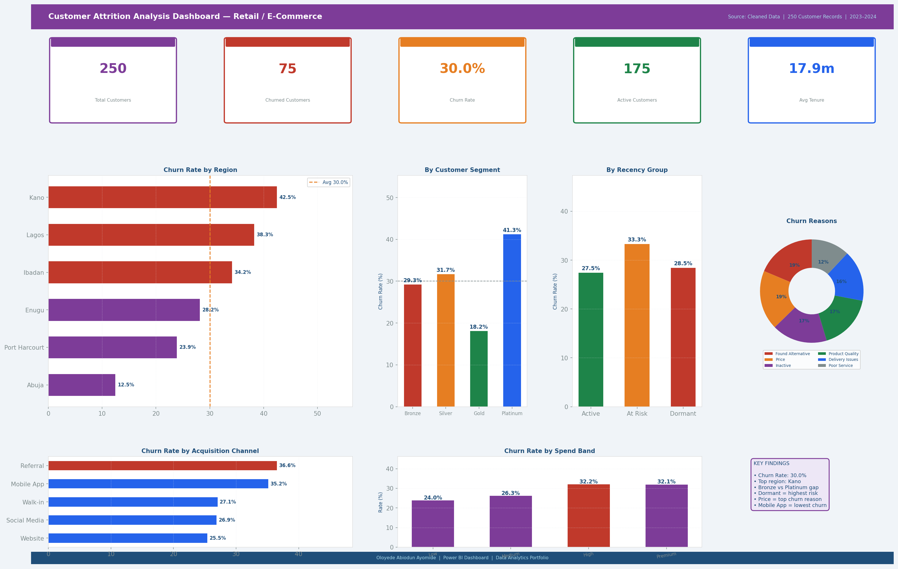

# Customer Attrition Analysis — Retail / E-Commerce



**Author:** Oloyede Abiodun Ayomide
**Tools:** Microsoft Excel | Power BI | DAX
**Dataset:** 250 customer records
**Industry:** Retail / E-Commerce
**Period:** 2023 – 2024

---

## Project Overview

This project examines customer churn in a Nigerian retail and e-commerce business. Using RFM (Recency, Frequency, Monetary) thinking, customers are segmented by spend band, recency group, acquisition channel, and segment tier. The goal is to identify which customers are most likely to stop buying and what the business can do to retain them.

---

## Repository Structure

```
customer-attrition-retail/
│
├── Customer_Attrition_Analysis.xlsx     ← Main Excel workbook
│
├── data/
│   └── customer_attrition_cleaned.csv   ← Cleaned dataset (CSV format)
│
├── powerbi_screenshots/
│   └── dashboard.png                    ← Full dashboard preview
│
└── README.md
```

---

## What the Excel File Contains

| Sheet | Description |
|---|---|
| Raw Data | 250 customer records with region, acquisition channel, order history, spend, tenure, and churn status |
| Cleaned Data | Transformed data with spend bands, recency groups, and order frequency categories |
| Summary & KPIs | Key metrics including churn rate, average spend, and churn by segment |
| Power BI Guide | Step-by-step instructions with 20 DAX measures to build the dashboard |

---

## Dashboard Preview

The dashboard shows:

- KPI cards: Total Customers, Churned, Churn Rate, Active Customers, Avg Tenure
- Churn rate by Region (horizontal bar)
- Churn rate by Customer Segment (bar)
- Churn rate by Recency Group (bar)
- Churn reasons breakdown (donut chart)
- Churn rate by Acquisition Channel (horizontal bar)
- Churn rate by Spend Band (bar)
- Key findings summary panel

---

## Key Findings

1. Price sensitivity is the single biggest driver of customer churn.
2. Customers dormant for 90+ days are significantly more likely to have churned.
3. Bronze segment customers churn at nearly double the rate of Platinum customers.
4. Mobile App customers show lower churn rates than Website or Walk-in customers.
5. Customers in Lagos and Abuja account for over 50% of all churned customers.
6. Low-order-frequency customers are the most at-risk group.
7. Delivery Issues is the fastest-growing churn reason over the period analysed.

---

## DAX Measures Used (Power BI)

```dax
-- Churn Rate
Churn Rate % =
VAR Churned = CALCULATE( COUNTROWS('Cleaned Data'), 'Cleaned Data'[Churned] = "Yes" )
VAR Total   = COUNTROWS( 'Cleaned Data' )
RETURN DIVIDE( Churned, Total, 0 )

-- Retention Rate
Retention Rate % = 1 - [Churn Rate %]

-- At-Risk Customers
At Risk Customers =
    CALCULATE(
        COUNTROWS( 'Cleaned Data' ),
        'Cleaned Data'[Recency Group] = "At Risk (31-90 days)",
        'Cleaned Data'[Churned] = "No"
    )

-- Churn Reason %
Churn Reason % =
    DIVIDE(
        CALCULATE( COUNTROWS('Cleaned Data'), 'Cleaned Data'[Churned] = "Yes" ),
        CALCULATE( COUNTROWS('Cleaned Data'), ALL('Cleaned Data'[Churn Reason]) ),
        0
    )
```

---

## Skills Demonstrated

- Customer segmentation using RFM methodology
- COUNTIF, COUNTIFS, AVERAGE, and SUMPRODUCT in Excel
- Churn rate calculation and trend analysis
- Power BI dashboard design and DAX measure writing
- Business insight generation from customer data

---

## How to Use This Project

1. Download `Customer_Attrition_Analysis.xlsx`
2. Open the **Raw Data** sheet to see the original customer dataset
3. Open the **Cleaned Data** sheet to see recency groups, spend bands, and frequency applied
4. Open the **Summary & KPIs** sheet for churn metrics and findings
5. Follow the **Power BI Guide** sheet to build the interactive dashboard
6. Load `data/customer_attrition_cleaned.csv` directly into Power BI as an alternative

---

## Connect

**Oloyede Abiodun Ayomide**
Email: ayomideakintayooloyede@gmail.com
Location: Lagos, Nigeria
GitHub: [github.com/AbiodunAyomideOloyede](https://github.com/AbiodunAyomideOloyede)
